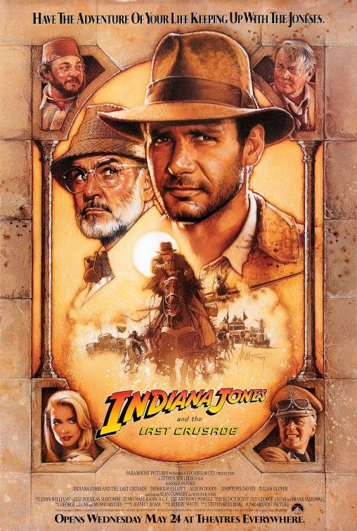
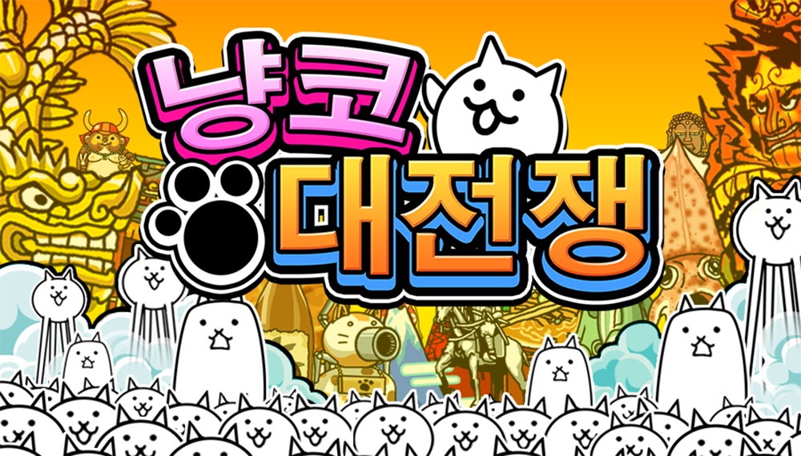
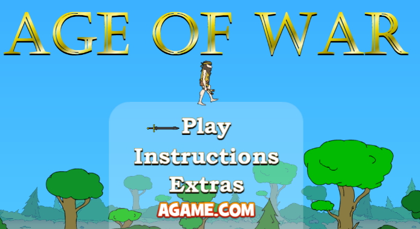
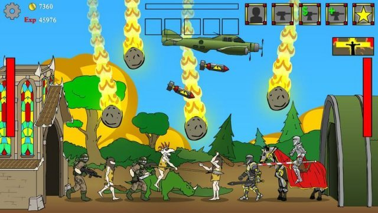

# 프로젝트명: We'll be rich(최준영)

# [ 목차 ]
### 1. [게임명 : We'll be rich] 
### 2. [컨셉](#2)
### 3. [관련 이미지 & 동영상](#3)
### 4. [대표 이미지](#4)
### 5. [컨셉 & 대표이미지 기반 작품묘사](#5)
### 6. [<We'll be rich> 구성 요소](#6)
### 7. [게임 시스템 디자인](#7)

  

# [컨셉] 

## 메인컨셉 :

- 모험, 위기

### 서브 컨셉 1 :

- 점프  - 몬스터들의 공격을 피할 수단이며 함정을 피할 수단이 됩니다. 첫 번째 점프는 일반 점프이며, 두 번째 점프는 뛰는 용도가 아닌 앞으로 전진하게 되는 슬라이딩으로 점프가 됩니다.

### 서브 컨셉 2 :

- 도트 디자인 - 도트로 완성되는 자그마한 

### 서브 컨셉 3 :

- 보물 - 게임의 목표

### 서브 컨셉 4 :

- 총 - 원거리에 있는 버튼을 누릅니다.

### 서브 컨셉 5 :

- 보물을 지키는 몬스터로 게임의 재미를 더해줍니다.

 

### [목차로 돌아가기](#main)

  

# [관련 이미지 & 동영상] 

- 이미지    
  

- 동영상  
  

 

### [목차로 돌아가기](#main)

  

# [대표 이미지] 

 

### [목차로 돌아가기](#main)

  

# [컨셉 & 대표이미지 기반 작품묘사] 

> ### 대표이미지 기반 : 인디아나 존스

> ### 컨셉 기반: 주인공이 세상에 알려지지 않은 보물들을 찾아다니며 보물을 찾아 자신의 부와 명예를 얻으려고 모험을 떠납니다. 게임은 2D 도트(미정)로 제작될 예정입니다.

 

### [목차로 돌아가기](#main)

  

# [<We'll be rich> 구성 요소] 

- We'll be rich (해석: 우리는 부자가 될꺼야!)
- 한 문장 묘사: 미지의 보물을 찾아 부자가 되고싶어 모험을 떠나는 어드벤쳐 게임

 

## 1. 메커니즘

[도전 과제]

1. 사막 지역을 돌파하여 황금 스카라베를 얻어라
2. 정글 지역을 돌파하여 황금 원숭이 상을 얻어라
3. 지하 동굴을 돌파하여 시환제의 관에 도달해라
4. 모험중 자잘한 보물들을 얻어서 점수를 얻어라
5. 아이템들을 사용하여 막힌지형들을 타파하라

 

[재미 요소]

1. 인디아나 존스를 모티브로한 캐릭터의 컨셉
2. 아이템과 적절한 판단으로 함정들을 이겨내기
3. 주변에 떨어져있는 작은 보물들을 주워 점수경쟁
4. 인디아나 존스의 사막 결투 장면을 패러디 한 이스터에그

 

[키조작]

WASD  : 캐릭터 이동

SPACE : 점프

J : 공격

K : 아이템 사용

 

## 2. 이야기

[만들게 된 배경]  

유명한 고고학자를 동경하며 세상에 알려지지 않은 보물을 발견하여 부귀영화를 누리는 것을 꿈꾸는 사람으로 미지의 보물을 찾아서 여행을 떠나게 된다.

 

[카메라 관점]  

사이드뷰 형식의 게임

 

## 3. 미적요소

[디자인][컬러]  

캐릭터 디자인 : 인디아나 존스와 흡사한 도트 디자인

몬스터 디자인 : 미라, 벌레, 뱀, 원시인, 병마용, 박쥐, 뼈무더기 

메인(인트로) 디자인 : 한 청년이 비행기에서 뛰어내릴 준비를 하고 엄지를 치켜 새운 뒤 스타트 버튼을 누르면 낙하 후 착지 사막의 모험 시작 설정 터치시 비행기 안으로 이동하며 지도를 펼치는 행동을 하고 설정화면이 나옴

인게임 디자인 : 사막, 정글, 지하미궁

아이템 디자인 : 밧줄, 권총, 다이너마이트, 삽

[음향]  

메인(인트로) 음향 : 인디아나 존스에 나오는 대표 음악처럼 웅장하고 활기와 모험심이 넘치는 배경음악을 한다.

메인(인트로)에 있는 버튼 클릭 시 : 스타트 버튼은 게임 제목인 we'll be rich를 외치고 하강 설정 터치 시 부스럭 거리는 소리 출력

인게임 배경음악 : 메탈슬러그에서 등장하는 각 지역의 음악들과 유사하게 넣는다.

인게임 효과음 : 지상에서는 인트로와 유사한 배경음, 지하로 진입시 약간 빠르게 진행, 보물을 얻고 돌아올때는 긴박한 배경을으로 바뀜
 

## 4. 기술

 PC용 패키지 게임을 목표로 출시 예정입니다.

  

# [게임 시스템 디자인] 

## 1. 게임 오브젝트 분해 (구성 요소 분석)

|연번|오브젝트 이름|오브젝트 이미지|
|:----:|:----:|:----:|
|1|플레이어||
|2|NPC||
|3|NPC||
|4|UI||
|5|UI||
|6|UI||
|7|UI||
|8|UI||
|9|아이템||
|10|아이템||
|11|아이템||
|12|아이템||
|13|아이템||
|14|아이템||
|15|아이템||
|16|아이템||
|17|아이템||
|18|아이템||
|19|아이템||
|20|아이템||
|21|보물||
|22|보물||
|23|보물||
|24|맵||
|25|맵||
|26|맵||
|27|몬스터||
|28|몬스터||
|29|몬스터||
|30|몬스터||
|31|몬스터||
|32|몬스터||
|33|몬스터||
|34|몬스터||
|35|몬스터||
|36|보스||
|37|보스||
|38|보스||
