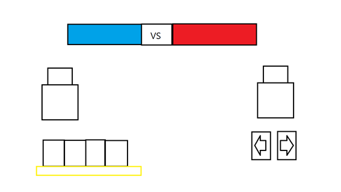

# 프로젝트명: 인마대전(최준영)

# [ 목차 ]  
### 1. [게임명 : 인마대전]
### 2. [컨셉](#2)
### 3. [관련 이미지 & 동영상](#3)
### 4. [대표 이미지](#4)
### 5. [컨셉 & 대표이미지 기반 작품묘사](#5)
### 6. [<인마대전> 구성 요소](#6)
### 7. [게임 시스템 디자인](#7)
### 8. [파라미터(속성)](#8)
### 9. [행동 뽑아 보기](#9)
### 10. [상태 뽑아 보기](#10)
### 11. [게임의 규칙](#11)
### 12. [요구사항](#12)
### 13. [프로토타입 개발 요구사항 (6주개발)](#13)
1. [1주차](#13-1)
2. [2주차](#13-2)
3. [3주차](#13-3)
4. [4주차](#13-4)
5. [5주차](#13-5)
6. [6주차](#13-6)

  

# [컨셉] 

## 메인컨셉 :

- 용기, 보호

### 서브 컨셉 1 :

- 전략  - 플레이 방식은 단순한 게임이지만 쉬움, 보통, 어려움을 넣어 난이도의 차별점을 두었습니다. 3가지 모드의 차이점은 적 AI의 자원이 조금씩 더 빠르게 찬다는 점이지만 쉬움과 다르게 어려움은 전열에 방패병을 두며 후열에는 궁수를 넣어 적들을 밀어내는 등의 상성과 조합을 생각하는 플레이를 하게 됩니다.

### 서브 컨셉 2 :

- 캐주얼 그래픽(감성을 자극하는 그래픽) - 고화질의 그래픽이 아닌 캐주얼한 도트그래픽으로 과거 유행하는 용사파티의
모습으로 게임을 주로 플레이하는 10대 20대에게는 쉽게 접근할 수 있게 하며 옛날 향수를 느끼고 싶어하는 30,40대에게는 익숙한 그리움을 목표로 제작 합니다.

### 서브 컨셉 3 :

- 빠른 전투 - 유닛은 3기로 단순하지만 자원의 생선을 빠르게하여 게임을 플레이 하는 내내 계속되는 전투를하여 짧지만 빠르게 즐길 수 있는 요소를 넣습니다.

### 서브 컨셉 4 :

- 디펜스 - 타워 디펜스 형식이 아닌 전략디펜스로 지루하게 방어만 하는것이 아닌 공격과 방어 두가지를 수행하며 게임의 전략적 긴장감을 주게됩니다.

### 서브 컨셉 5 :

- 단순하고 짧은 플레이 타임 - 게임의 플레이 타임은 짧지만 게임 플레이어의 목표로하는 적은 시간에 짧게 즐기는 플레이어를 목표로 게임을 제작

 

### [목차로 돌아가기](#main)

  

# [관련 이미지 & 동영상] 

- 캐릭터 컨셉 이미지    
  

- 동영상  
  

 

  

# [대표 이미지] 

 

### [목차로 돌아가기](#main)

  

# [컨셉 & 대표이미지 기반 작품묘사] 

> ### 대표이미지 기반 : 워크래프트

> ### 컨셉 기반 : 점점 인간의 세력을 침범하는 마족들에 불안을 느끼며 왕국의 평화를 위하여 왕국에서 용기 있는 자를 선발하고 그들에게 피해를 보는 동맹에 도움을 요청하여 전쟁을 시작하게 되었습니다.

 

### [목차로 돌아가기](#main)

  

# [<인마대전> 구성 요소] 

- 인마대전 (해석 : 인간과 마족의 전쟁)
- 한 문장 묘사 : 인간들의 터전을 지키고 마족들을 물리치자

 

### [목차로 돌아가기](#main)

  

## 1. 메커니즘

[도전 과제]

플레이 중 한 가지 캐릭터만 소환해서 클리어 했을 때 업적 클리어(난이도 상관없이 가능)

1. 기사 : 인도받는 자의 성배
게임 드래곤 퀘스트 4의 부제 인도받는 자 와 영화 몬티 파이튼의 성배를 패러디한 업적
2. 궁수 : They're taking the orks to Cattle
영화 반지의 제왕의 레골라스 대사 They're taking the Hobbits to Isengard 패러디한 업적
3. 방패병 : 그래, 그건 기꺼이 할 수 있지
영화 반지의 제왕의 김 리와 레골라스의 대사인 
“김리: 요정 따위의 곁에 서서 싸우다 죽게 될 줄은 몰랐군(Never thought I'd die fighting side by side with an Elf).
레골라스: 그럼 친구 곁에 서는 건 어때(What about side by side with a friend)?
김리: 그래, 그건 기꺼이 할 수 있지(Aye, I can do that).“ 패러디한 업적

 

[재미 요소]

1. 워크래프트를 모티브로한 캐릭터의 컨셉
2. 자원과 상성을 활용하여 적들을 이겨내기
3. 다양한 난이도로 게임의 긴장감을 상승
4. 반지의 제왕 장면을 패러디 한 이스터에그

 

[키조작]

좌측 하단 : 유닛 소환 패널
우측 하단 : 화면의 좌우로 이동 할 수 있는 키

 

### [목차로 돌아가기](#main)

  

## 2. 이야기

[만들게 된 배경]  

디펜스 게임은 컨트롤의 요소보다 전략을 더 중요시하는 게임입니다. 디펜스 게임으로 유명한 게임은 식물 VS 좀비와 명일방주, 카운터사이드 등 유명한 게임이 많지만 제가 기억에 남는 디펜스 게임은 전쟁의 시대라는 플래시 게임입니다. 게임은 서로 양 끝에 기지를 두어 자원을 활용하여 전투유닛을 소환하여 상대방의 기지를 부수면 되는 간단한 게임입니다. 유닛은 3종류로 근접, 원거리, 엘리트 유닛으로 간단한 전략으로 즐길 수 있습니다. 저는 그런 추억을 생각하며 디펜스 게임을 만들고자 합니다. 게임의 테마는 수호(보호)입니다. 게임의 테마로 진취적이지는 아니지만 게임의 주인공(게임 유닛)들은 저마다 자신들이 지키고 싶어하는 것을 위하여 전투에 참여한 만큼 최종 승패 목적도 기지(베이스)의 파괴이므로 수호(보호)를 테마로 잡았습니다. 예전의 드래곤 퀘스트처럼 용사와 그에 맞서는 마족들로 도트그래픽에 어울리는 올드 스타일의 게임이 될 예정입니다. 게임 제작의 목적은 아무래도 요즘 출시 또는 인기 있는 게임과는 거리가 있는 도트 디펜스를 선정함으로써 옛날 게임이라 느낄 수 올드감성을 다시 한번 느꼈으면 좋을 것 같았습니다.

 

### [목차로 돌아가기](#main)

  

[카메라 관점]  

사이드뷰 형식의 모바일 게임

 

## 3. 미적요소

캐릭터 디자인 : 드래곤 퀘스트를 모티브로 한 도트 디자인

몬스터 디자인 : 오크, 스켈레톤, 골렘, 기지(적군 베이스) 

메인(인트로) 디자인 : 신하가 다급하게 뛰어와서 왕에게 보고하고 보고를 받은 왕의 안색은 어두워지지만 이내 다짐하고 팔을 뻗어서 하명하며 게임 메뉴 출력

인게임 디자인 : 숲과 들판

아이템 디자인 : 기사, 궁수, 방패병 비콘

[음향]  

메인(인트로) 음향 : 중세 시대가 느껴지는 약간 웅장하며 경쾌한 배경음악

메인(인트로)에 있는 버튼 클릭 시 : 게임 시작 버튼을 누르면 짧은 나팔 소리가 들린다

인게임 배경음악 : 전쟁 시대가 생각나는 전투의 긴장감과 약간의 경쾌함의 음악을 넣는다.

인게임 효과음 : 피격음과 사망음, 기지의 파괴음을 추가한다.

 

### [목차로 돌아가기](#main)

  

## 4. 기술

 모바일용 싱글 게임을 목표로 출시 예정입니다.

 

### [목차로 돌아가기](#main)

  

# [게임 시스템 디자인] 

## 1. 게임 오브젝트 분해 (구성 요소 분석)

|연번|오브젝트 이름|오브젝트 이미지|
|:----:|:----:|:----:|
|1|근접 전사(용사)||
|2|원거리 궁수(엘프)||
|3|방패병(드워프)||
|4|UI (Health)||
|5|UI (Rope)||
|6|UI (Dynamite)||
|7|UI (Scoreboard)||
|8|UI (Stage)||
|9|Map (Desert)||
|10|근접 전사(오크)||
|11|원거리 궁수(스켈레톤)||
|12|방패병(골렘)||

 

### [목차로 돌아가기](#main)

  

# [파라미터(속성)]  

### 1) 오브젝트 이름 : 근접 전사(용사)

|속성|영문명칭|설명|
|:----:|:----:|:----:|
|이동속도|speed|캐릭터의 이동속도|
|공격|attack|캐릭터의 공격|
|체력|health|캐릭터의 체력|
|자원|resource|캐릭터 소화에 필요한 자원|

 

### 2) 오브젝트 이름 : 원거리 궁수(엘프)

|속성|영문명칭|설명|
|:----:|:----:|:----:|
|이동속도|speed|캐릭터의 이동속도|
|공격|attack|캐릭터의 공격|
|체력|health|캐릭터의 체력|
|자원|resource|캐릭터 소화에 필요한 자원|

 

### 3) 오브젝트 이름 : 방패병(드워프)

|속성|영문명칭|설명|
|:----:|:----:|:----:|
|이동속도|speed|캐릭터의 이동속도|
|공격|attack|캐릭터의 공격|
|체력|health|캐릭터의 체력|
|자원|resource|캐릭터 소화에 필요한 자원|

 

### 4) 오브젝트 이름 : 성(왕)

|속성|영문명칭|설명|
|:----:|:----:|:----:|
|체력|health|캐릭터의 체력|

 

### 5) 오브젝트 이름 : 근접 전사(오크)

|속성|영문명칭|설명|
|:----:|:----:|:----:|
|이동속도|speed|캐릭터의 이동속도|
|공격|attack|캐릭터의 공격|
|체력|health|캐릭터의 체력|

 

### 6) 오브젝트 이름 : 원거리 궁수(스켈레톤)

|속성|영문명칭|설명|
|:----:|:----:|:----:|
|이동속도|speed|캐릭터의 이동속도|
|공격|attack|캐릭터의 공격|
|체력|health|캐릭터의 체력|

 

### 7) 오브젝트 이름 : 방패병(골렘)

|속성|영문명칭|설명|
|:----:|:----:|:----:|
|이동속도|speed|캐릭터의 이동속도|
|공격|attack|캐릭터의 공격|
|체력|health|캐릭터의 체력|

 

### [목차로 돌아가기](#main)

  

# [행동 뽑아 보기]  

### 1) 오브젝트 이름 : 근접 전사(용사)

|속성|영문명칭|설명|
|:----:|:----:|:----:|
|이동|move|근접 전사(용사)의 기본 이동|
|공격|attack|1회 공격 검을 꺼내서 적을 공격 일정 시간의 쿨타임을 가진다|
|사망|dead|유닛의 체력을 초과하는 공격이 누적되면 유닛이 사망한다|

 

### 2) 오브젝트 이름 : 원거리 궁수(엘프)

|속성|영문명칭|설명|
|:----:|:----:|:----:|
|이동|move|원거리 궁수(엘프)의 기본 이동|
|공격|attack|1회 공격 활을 꺼내서 원거리로 적을 공격 일정 시간의 쿨타임을 가진다|
|사망|dead|유닛의 체력을 초과하는 공격이 누적되면 유닛이 사망한다|

 

### 3) 오브젝트 이름 : 방패병(드워프)

|속성|영문명칭|설명|
|:----:|:----:|:----:|
|이동|move|방패병(드워프)의 기본 이동|
|공격|attack|1회 공격 방패로 적을 공격 일정 시간의 쿨타임을 가진다|
|사망|dead|유닛의 체력을 초과하는 공격이 누적되면 유닛이 사망한다|

 

### 4) 오브젝트 이름 : 성(왕)

|속성|영문명칭|설명|
|:----:|:----:|:----:|
|자원|resource|유닛을 소환 할 수 있는 자원을 주기적으로 생산한다|

 

### 5) 오브젝트 이름 : 근접 전사(오크)

|속성|영문명칭|설명|
|:----:|:----:|:----:|
|이동|move|근접 전사(오크)의 기본 이동|
|공격|attack|1회 공격 검을 꺼내서 적을 공격 일정 시간의 쿨타임을 가진다|
|사망|dead|유닛의 체력을 초과하는 공격이 누적되면 유닛이 사망한다|

 

### 6) 오브젝트 이름 : 원거리 궁수(스켈레톤)

|속성|영문명칭|설명|
|:----:|:----:|:----:|
|이동|move|원거리 궁수(스켈레톤)의 기본 이동|
|공격|attack|1회 공격 활을 꺼내서 원거리로 적을 공격 일정 시간의 쿨타임을 가진다|
|사망|dead|유닛의 체력을 초과하는 공격이 누적되면 유닛이 사망한다|

 

### 7) 오브젝트 이름 : 방패병(골렘)

|속성|영문명칭|설명|
|:----:|:----:|:----:|
|이동|move|방패병(골렘)의 기본 이동|
|공격|attack|1회 공격 방패로 적을 공격 일정 시간의 쿨타임을 가진다|
|사망|dead|유닛의 체력을 초과하는 공격이 누적되면 유닛이 사망한다|

 

### [목차로 돌아가기](#main)

  

# [상태 뽑아 보기]  

### 1) 오브젝트 이름 : 모든 유닛 공통

|현상태|전이상태|전이조건|
|:----:|:----:|:----:|
|Idle|이동|유닛 앞에 이동 할 수 있는 공간이 있을 때|
|이동|정지|유닛 앞에 공간이 없거나 적 유닛을 만났을때|
|정지|공격|유닛 앞에 적 유닛이 존재할 때|
|공통|사망|체력이 1미만으로 내려갔을 시|
|사망|시체|사망 후 시체 생성 -> 일정 시간 후 시체 삭제|

 

### 2) 오브젝트 이름 : 성(왕)

|현상태|전이상태|전이조건|
|:----:|:----:|:----:|
|Idle|피격|적 유닛의 공격을 받았을 때 약간 붉은색을 띠게 표시|
|피격|파괴|체력이 1미만으로 내려갔을 시|

 

### 3) 유닛 강화

|유닛명|이미지|강화 전|이미지|강화 후|
|:----:|:----:|:----:|:----:|:----:|
|근접 전사(용사)|   -  |체력: 10 공격력: 2|   -  |체력: 15 공격력: 4|
|원거리 궁수(엘프)| -    |체력: 5 공격력: 1|  -   |체력: 10 공격력: 2|
|방패병(드워프)| -    |체력: 30 공격력: 1|   -  |체력: 40 공격력: 2|
|마법사(왕)|  -   |공격력: 1|  -   |공격력: 2|
|근접 전사(오크)|    - |체력: 10 공격력: 2|  -   |체력: 15 공격력: 4|
|원거리 궁수(스켈레톤)| -    |체력: 5 공격력: 1|  -   |체력: 10 공격력: 2|
|방패병(골렘)|-     |체력: 30 공격력: 1|  -   |체력: 40 공격력: 2|
|마법사(왕)|   -  |공격력: 1|  -   |공격력: 2|

### [목차로 돌아가기](#main)

  

# [게임의 규칙] 

### 1) 핵심 규칙
주기적으로 생성되는 자원을 활용하여 적의 성을 공략  

### 2) 보조 규칙
적의 공격 받아 일정 이상의 데미지를 받아 플레이어 성의 파괴되면 게임 오버 
플레이어 유닛을 생산하여 적의 성을 파괴하면 게임 승리 

### 3) 게임에서 사용될 공식
쉬움 모드 : 플레이어의 자원생산을 초당 1로 두었을 때 적은 초당 0.6정도로 쉽게 깰 수 있게 설정 
보통 모드 : 플레이어와 자원 생산을 동일하게 설정 
어려움 모드 : 플레이어보다 자원 생산을 더 빠르게하여 일반적인 무지성 소환이 아닌 뽑는 순서와 조합을 고민하게 설정 
 

### [목차로 돌아가기](#main)

  

# [요구사항] 

## 프로그래밍 요구사항

### [메뉴]

1. 시작화면, 배경화면이 있다.
2. 타이틀 로고가 짧게 위,아래로 이동한다.
3. 시작화면에는 Easy, Normal, Hard 버튼이 있다.

 

### [스테이지 구성]

1. 2D 사이드 뷰 시점 카메라를 사용한다.
2. 게임 시작 시 플레이어 베이스에서 시작한다.
3. 1초마다 자원 1을 생산한다.
4. 각 유닛은 일정 자원을 사용하여 강화를 할 수 있다.
5. Easy 모드는 적 자원 생산을 1로 한다.
6. Normal 모드는 적 자원 생산을 1.25로 한다.
7. Hard 모드는 적 자원 생산을 1.5로 한다.
8. 화면 상단에 아군,적군 베이스의 현재 체력을 표시한다.
9. 게임 승리 시 인게임 정지 후 Victory와 돌아가기 버튼이 생성된다.
10. 게임 패배 시 인게임 정지 후 Defeat와 돌아가기 버튼이 생성된다.
 

### [플레이어]

1. 게임화면에서 근접 전사 터치 시 자원 3을 소모하여 소환한다.
2. 게임화면에서 원거리 궁수 터치 시 자원 5를 소모하여 소환한다.
3. 게임화면에서 방패병 터치 시 자원 7을 소모하여 소환한다.
4. 자원 10을 모아 성 강화버튼을 누르면 마법사를 소환한다.
5. 자원 10을 모아 성 강화버튼을 누르면 마법사를 강화한다.
6. 자원 10을 모아 근접 전사 강화버튼을 누르면 근접 전사를 강화한다.
7. 자원 10을 모아 원거리 궁수 강화버튼을 누르면 원거리 궁수를 강화한다.
8. 자원 10을 모아 방패병 강화버튼을 누르면 방패병을 강화한다.
9. 화면 우측 하단에 좌,우 버튼을 누르면 카메라가 이동하여 화면 시점을 방향에 맞게 이동한다.

 

### [적 유닛]

1. 유닛은 근접 전사, 원거리 궁수, 방패병으로 구성된다.
2. 유닛 스테이터스는 플레이어 유닛과 동일하다.

 

### [AI]

1. AI는 자원이 5가 모이면 준비된 패턴에서 랜덤으로 패턴 하나를 실행 한다.
2. 자원이 5가 모이면 근접 전사 또는 원거리 궁수를 소환한다.
3. 자원이 5가 모이면 자원이 7까지 모일 때 까지 기다린다.
4. 자원이 7가 모이면 근접 전사 또는 원거리 궁수 또는 방패병을 소환한다.
5. 자원이 7가 모이면 자원이 10까지 모일 때 까지 기다린다.
6. 자원이 10가 모이면 유닛을 강화한다.

 

### [스테이지 세이브]

1. 스테이지 클리어하면 각 난이도 패널 좌측 상단에 클리어 메달을 표시한다. 

 

## 그래픽 디자인

1. 그래픽 리소스는 에셋 또는 게임구현과 동시에 aseprite 그림 툴을 사용하여 수정 및 제작한다.

### [메인메뉴]

1. 타이틀을 제작한다.
2. Easy, Normal, Hard 버튼을 제작한다.
3. 클리어 메달을 제작한다.

 

### [스테이지]

1. 스테이지 지형을 제작한다.

 

### [오브젝트]

1. 체력UI, 모든 유닛 및 베이스, 원거리 궁수의 화살 등 게임에 사용되는 오브젝트 리소스들을 제작한다.

 

### [목차로 돌아가기](#main)

  

# [프로토타입 개발 요구사항 (6주개발)] 

### [스테이지 구성]

1. ~~2D 사이드 뷰 시점 카메라를 사용한다.~~
2. ~~게임 시작 시 플레이어 베이스에서 시작한다.~~
3. ~~1초마다 자원 1을 생산한다.~~
4. ~~각 유닛은 일정 자원을 사용하여 강화를 할 수 있다.~~
5. Easy 모드는 적 자원 생산을 1로 한다.
6. Normal 모드는 적 자원 생산을 1.25로 한다.
7. Hard 모드는 적 자원 생산을 1.5로 한다.
8. 화면 상단에 아군,적군 베이스의 현재 체력을 표시한다.
9. 게임 승리 시 인게임 정지 후 Victory와 돌아가기 버튼이 생성된다.
10. 게임 패배 시 인게임 정지 후 Defeat와 돌아가기 버튼이 생성된다.

 

### [플레이어]

1. 게임화면에서 근접 전사 터치 시 자원 3을 소모하여 소환한다.
2. 게임화면에서 원거리 궁수 터치 시 자원 5를 소모하여 소환한다.
3. 게임화면에서 방패병 터치 시 자원 7을 소모하여 소환한다.
4. 자원 10을 모아 성 강화버튼을 누르면 마법사를 소환한다.
5. 자원 10을 모아 성 강화버튼을 누르면 마법사를 강화한다.
6. 자원 10을 모아 근접 전사 강화버튼을 누르면 근접 전사를 강화한다.
7. 자원 10을 모아 원거리 궁수 강화버튼을 누르면 원거리 궁수를 강화한다.
8. 자원 10을 모아 방패병 강화버튼을 누르면 방패병을 강화한다.
9. 화면 우측 하단에 좌,우 버튼을 누르면 카메라가 이동하여 화면 시점을 방향에 맞게 이동한다.

 

### [적 유닛]

1. 유닛은 근접 전사, 원거리 궁수, 방패병으로 구성된다.
2. 유닛 스테이터스는 플레이어 유닛과 동일하다.

### [기타]
1. 사운드 리소스 준비
2. 버그 

 

### [목차로 돌아가기](#main)

  

## [1주차]

 

### [스테이지]

 

1. 2D 사이드 뷰 시점 카메라를 사용한다.
2. 1초마다 자원 1을 생산한다.

 

### [목차로 돌아가기](#main)

 

## [2주차]

 

### [플레이어]

 

1. 게임화면에서 근접 전사 터치 시 자원 3을 소모하여 소환한다.
2. 게임화면에서 원거리 궁수 터치 시 자원 5를 소모하여 소환한다.
3. 게임화면에서 방패병 터치 시 자원 7을 소모하여 소환한다.

 

### [몬스터]
1. 유닛은 근접 전사, 원거리 궁수, 방패병으로 구성된다.
2. 유닛 스테이터스는 플레이어 유닛과 동일하다.

 

### [목차로 돌아가기](#main)

 

## [3주차]

 

### [플레이어]

1. 자원 10을 모아 성 강화버튼을 누르면 마법사를 소환한다.
2. 자원 10을 모아 성 강화버튼을 누르면 마법사를 강화한다.
3. 자원 10을 모아 근접 전사 강화버튼을 누르면 근접 전사를 강화한다.
4. 자원 10을 모아 원거리 궁수 강화버튼을 누르면 원거리 궁수를 강화한다.
5. 자원 10을 모아 방패병 강화버튼을 누르면 방패병을 강화한다.
6. 화면 우측 하단에 좌,우 버튼을 누르면 카메라가 이동하여 화면 시점을 방향에 맞게 이동한다.

 

### [목차로 돌아가기](#main)

 

### [4주차]

 

### [스테이지]

 

1. Easy 모드는 적 자원 생산을 1로 한다.
2. Normal 모드는 적 자원 생산을 1.25로 한다.
3. Hard 모드는 적 자원 생산을 1.5로 한다.
4. 화면 상단에 아군,적군 베이스의 현재 체력을 표시한다.

 

### [목차로 돌아가기](#main)

 

### [5주차]

 

### [AI]

1. AI는 자원이 5가 모이면 준비된 패턴에서 랜덤으로 패턴 하나를 실행 한다.
2. 자원이 5가 모이면 근접 전사 또는 원거리 궁수를 소환한다.
3. 자원이 5가 모이면 자원이 7까지 모일 때 까지 기다린다.
4. 자원이 7가 모이면 근접 전사 또는 원거리 궁수 또는 방패병을 소환한다.
5. 자원이 7가 모이면 자원이 10까지 모일 때 까지 기다린다.
6. 자원이 10가 모이면 유닛을 강화한다.

 

### [목차로 돌아가기](#main)

 

### [6주차]

 

### []

 

1. 사운드 리소스 적용
2. 버그 수정

 

### [목차로 돌아가기](#main)

  
